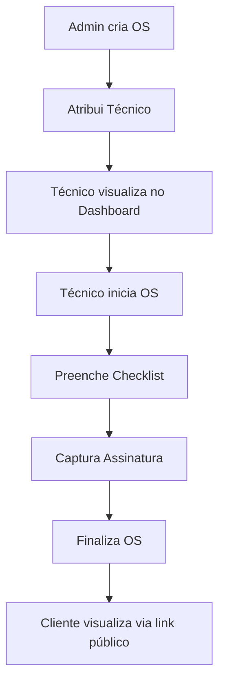

# 🚀 Nexus Pro - Sistema de Gerenciamento de Ordens de Serviço

Sistema completo de gerenciamento de ordens de serviço com suporte a multi-tenancy, desenvolvido com **React**, **TypeScript**, **Vite** e **Supabase**.

---

## ✨ Funcionalidades

### 👥 Multi-Tenancy
- Suporte a múltiplas empresas no mesmo sistema
- Isolamento completo de dados por tenant
- Configuração personalizada de numeração de OS por empresa

### 🔐 Autenticação e Permissões
- Login para Administradores e Técnicos
- Sistema de permissões granulares
- Níveis: Super Admin, Admin, Técnico

### 📋 Gerenciamento de Ordens de Serviço
- Criação, edição e exclusão de ordens
- Status: Pendente, Atribuído, Em Andamento, Concluído, Cancelado
- Prioridades: Baixa, Média, Alta, Crítica
- Numeração automática personalizada por empresa
- Atribuição de técnicos
- Agendamento de datas e horários
- Checklist customizável por tipo de equipamento

### 👨‍💼 Gerenciamento de Clientes
- Cadastro de Pessoas Físicas (CPF) e Jurídicas (CNPJ)
- Validação de documentos
- Histórico de ordens por cliente
- Integração com equipamentos

### 🔧 Gerenciamento de Equipamentos
- Cadastro de famílias de equipamentos
- Controle de serial, modelo e descrição
- Vinculação com clientes
- Histórico de manutenções

### 👷 Gerenciamento de Técnicos
- Cadastro completo de técnicos
- Visualização de ordens atribuídas
- Dashboard personalizado para técnicos

### 📊 Dashboard e Relatórios
- Visão geral de indicadores
- Ordens por status
- Performance de técnicos
- Estatísticas em tempo real

### 📝 Formulários Dinâmicos
- Checklists customizáveis
- Campos: Texto, Seleção, Foto, Assinatura
- Templates por tipo de equipamento
- Captura de assinaturas

### 🔍 Visualização Pública
- Link público para acompanhamento de ordens
- Sem necessidade de login
- Informações seguras e filtradas

---

## 🏗️ Arquitetura do Projeto

```
Nexus Pro/
├── 📱 FRONTEND (React + TypeScript + Vite)
│   ├── src/
│   │   ├── components/      # Componentes React
│   │   ├── services/        # Serviços de integração
│   │   ├── lib/            # Bibliotecas (Supabase client)
│   │   ├── types/          # Tipos TypeScript
│   │   └── App.tsx         # Componente principal
│   └── public/             # Assets estáticos
│
├── 🔧 BACKEND (Supabase Edge Functions)
│   ├── functions/          # Edge Functions (Deno)
│   │   ├── get-orders/    # Buscar ordens com filtros
│   │   └── create-order/  # Criar ordens com validação
│   ├── schemas/           # Schemas de validação
│   └── types/             # Tipos do backend
│
├── 🗄️ SUPABASE
│   └── migrations/        # Migrações do PostgreSQL
│       ├── supabase_schema.sql
│       ├── migration_add_os_config.sql
│       └── migration_fix_orders_id.sql
│
└── 🤝 SHARED
    ├── types/             # Tipos compartilhados
    ├── constants/         # Constantes compartilhadas
    └── utils/             # Utilitários compartilhados
```

📚 **Documentação Completa**: Veja [PROJECT_STRUCTURE.md](./PROJECT_STRUCTURE.md)

---

## 🚀 Início Rápido

### Pré-requisitos

- **Node.js** 18+ 
- **npm** ou **yarn**
- Conta no **Supabase** (gratuita)

### 1️⃣ Clone o Repositório

```bash
git clone https://github.com/seu-usuario/nexus-pro.git
cd nexus-pro
```

### 2️⃣ Instale as Dependências

```bash
npm install
```

### 3️⃣ Configure as Variáveis de Ambiente

Crie um arquivo `.env` na raiz do projeto:

```env
VITE_SUPABASE_URL=https://seu-projeto.supabase.co
VITE_SUPABASE_ANON_KEY=sua-chave-anonima
GEMINI_API_KEY=sua-chave-gemini (opcional)
```

### 4️⃣ Configure o Banco de Dados

Execute as migrações no Supabase:

```bash
# 1. Instale o Supabase CLI
npm install -g supabase

# 2. Faça login
supabase login

# 3. Vincule seu projeto
supabase link --project-ref SEU_PROJECT_REF

# 4. Execute as migrações
supabase db push
```

Ou execute os arquivos SQL manualmente no Dashboard do Supabase:
- `supabase/migrations/supabase_schema.sql`
- `supabase/migrations/migration_add_os_config.sql`
- `supabase/migrations/migration_fix_orders_id.sql`

### 5️⃣ Execute o Projeto

```bash
npm run dev
```

Acesse: **http://localhost:3000**

---

## 🛠️ Scripts Disponíveis

```bash
# Desenvolvimento
npm run dev              # Inicia servidor de desenvolvimento

# Build
npm run build            # Gera build de produção

# Preview
npm run preview          # Preview do build de produção
```

### Backend (Edge Functions)

```bash
cd backend

# Servir localmente
npm run serve

# Deploy no Supabase
npm run deploy

# Deploy de função específica
npm run deploy:orders
```

---

## 📖 Documentação

- 📘 [Estrutura do Projeto](./PROJECT_STRUCTURE.md)
- 🔄 [Guia de Migração](./MIGRATION_GUIDE.md)
- 🔧 [Backend README](./backend/README.md)

---

## 🔐 Credenciais de Teste

Para testar o sistema, você pode criar usuários via Supabase Auth ou usar o sistema de login já implementado.

**Configuração Inicial:**
1. Crie um usuário Admin via Supabase Dashboard
2. Insira o registro na tabela `users`
3. Configure as permissões apropriadas

---

## 🏢 Multi-Tenancy

O sistema suporta múltiplas empresas (tenants) no mesmo banco de dados:

1. **Cada empresa tem**:
   - Slug único (URL amigável)
   - Configuração de numeração de OS personalizada
   - Isolamento completo de dados

2. **Configuração de Numeração**:
   ```
   osPrefix: 'OS'           # Prefixo da ordem
   osStartNumber: 1000      # Número inicial
   Resultado: OS-2026-0001, OS-2026-0002, etc.
   ```

---

## 🛡️ Segurança

- ✅ **Row Level Security (RLS)** - Políticas de acesso por tenant
- ✅ **Autenticação JWT** - Supabase Auth
- ✅ **Validação de Dados** - Frontend e Backend
- ✅ **HTTPS** - Comunicação segura
- ✅ **Variáveis de Ambiente** - Chaves secretas protegidas

---

## 🎨 Tecnologias Utilizadas

### Frontend
- **React 19** - Biblioteca UI
- **TypeScript** - Tipagem estática
- **Vite** - Build tool ultra-rápido
- **Lucide React** - Ícones modernos

### Backend
- **Supabase** - Backend as a Service
- **PostgreSQL** - Banco de dados relacional
- **Edge Functions (Deno)** - Serverless functions
- **Row Level Security** - Segurança nativa

### Ferramentas
- **Git** - Controle de versão
- **ESLint** - Linting
- **Path Aliases** - Imports limpos

---

## 📦 Estrutura de Dados

### Principais Tabelas

- `tenants` - Empresas/Organizações
- `users` - Usuários do sistema
- `orders` - Ordens de serviço
- `customers` - Clientes (PF e PJ)
- `equipments` - Equipamentos
- `equipment_families` - Famílias de equipamentos
- `form_templates` - Modelos de checklist
- `audit_logs` - Logs de auditoria (planejado)

---

## 🔄 Fluxo de Trabalho



---

## 🚧 Roadmap

- [x] Sistema de autenticação
- [x] CRUD de ordens de serviço
- [x] Multi-tenancy
- [x] Formulários dinâmicos
- [x] Assinaturas digitais
- [x] Dashboard de indicadores
- [ ] Notificações push
- [ ] App mobile (React Native)
- [ ] Relatórios em PDF
- [ ] Integração com WhatsApp
- [ ] Offline-first mode

---

## 🤝 Contribuindo

Contribuições são bem-vindas! Por favor:

1. Faça um fork do projeto
2. Crie uma branch para sua feature (`git checkout -b feature/MinhaFeature`)
3. Commit suas mudanças (`git commit -m 'Adiciona MinhaFeature'`)
4. Push para a branch (`git push origin feature/MinhaFeature`)
5. Abra um Pull Request

---

## 📄 Licença

Este projeto está sob a licença **MIT**. Veja o arquivo [LICENSE](./LICENSE) para mais detalhes.

---

## 👨‍💻 Autor

**Equipe Nexus Pro**

---

## 📞 Suporte

Para dúvidas ou problemas:
- 📧 Email: suporte@nexuspro.com
- 📖 Documentação: [Wiki do Projeto](./docs)
- 🐛 Issues: [GitHub Issues](https://github.com/seu-usuario/nexus-pro/issues)

---

## 🌟 Agradecimentos

- Comunidade React
- Equipe Supabase
- Contribuidores do projeto

---

<div align="center">

**Desenvolvido com ❤️ usando React, TypeScript e Supabase**

[⬆ Voltar ao topo](#-nexus-pro---sistema-de-gerenciamento-de-ordens-de-serviço)

</div>
# Vercel Deploy Tue Feb  3 07:16:31 -03 2026
